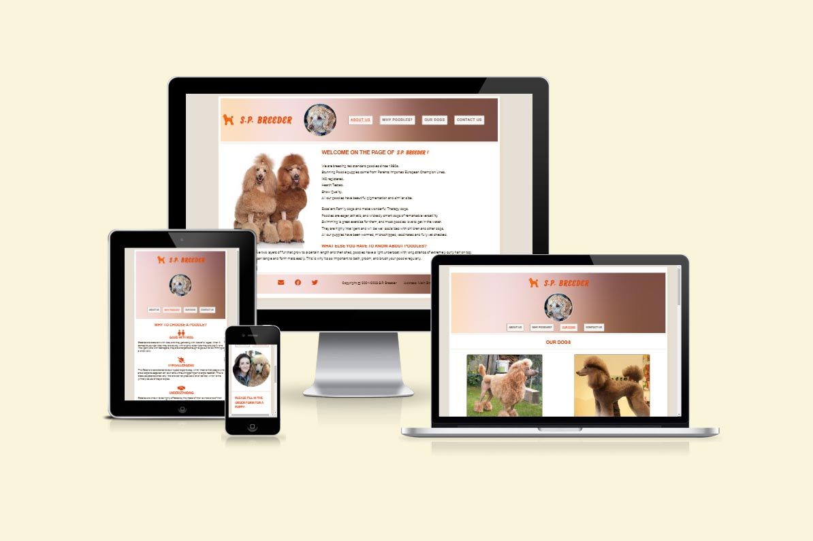
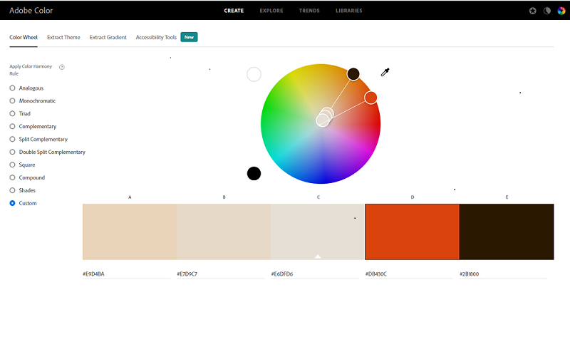
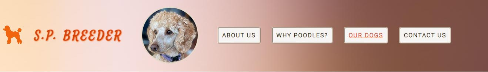
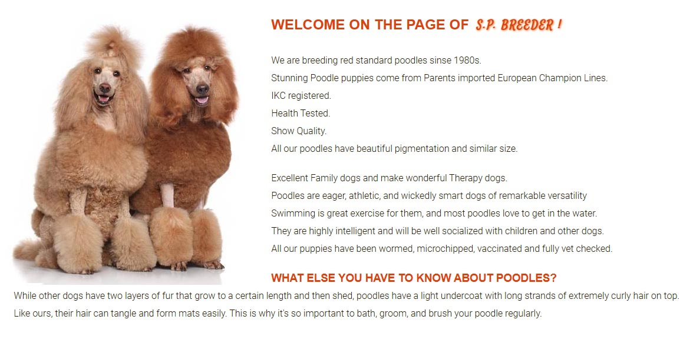
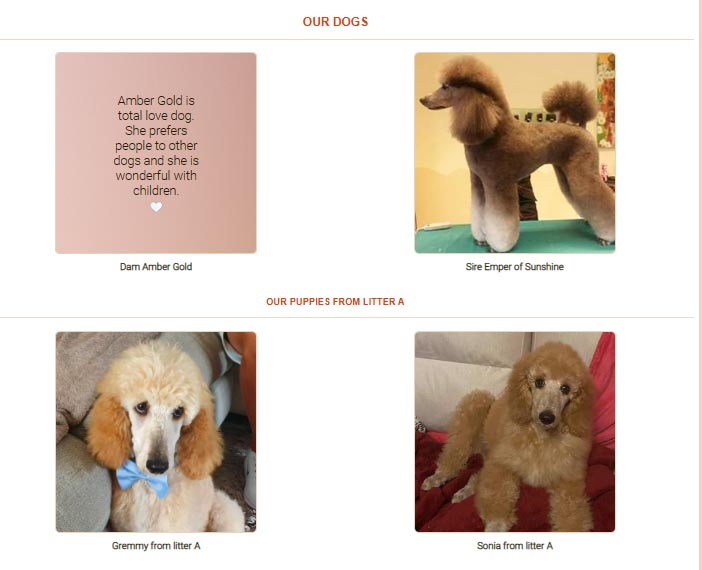
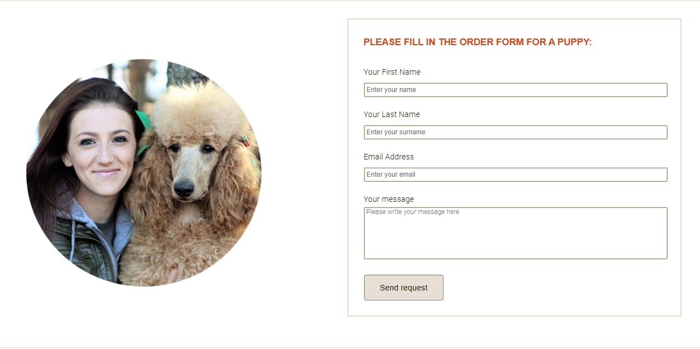
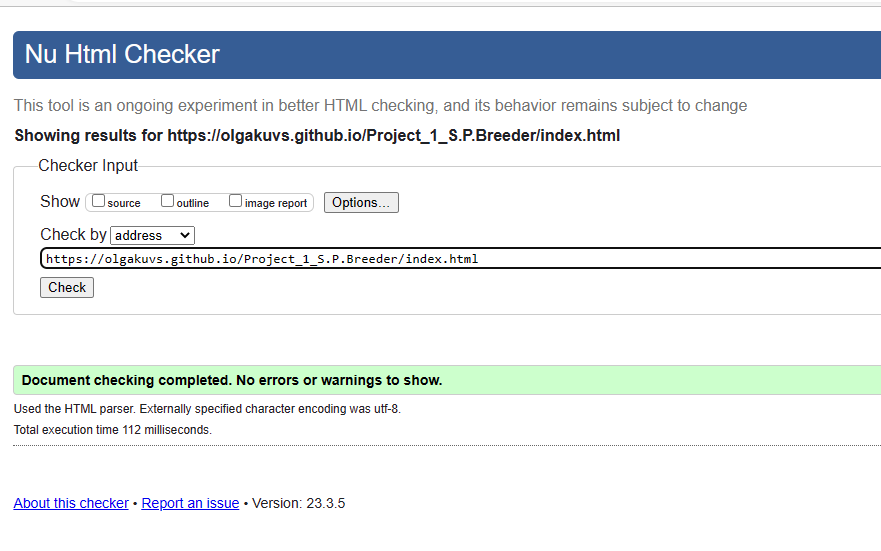
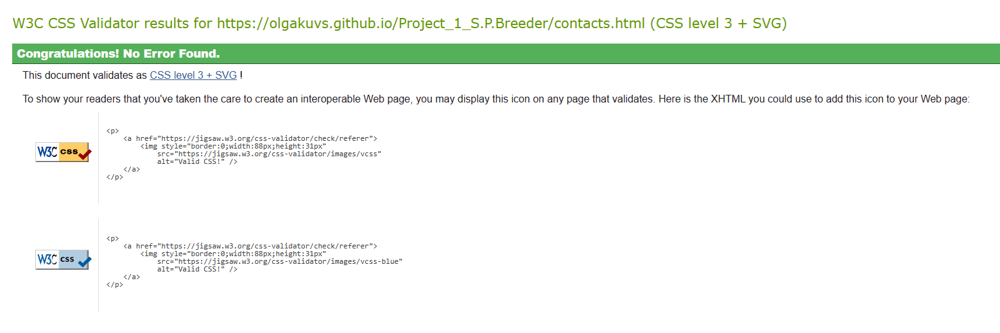
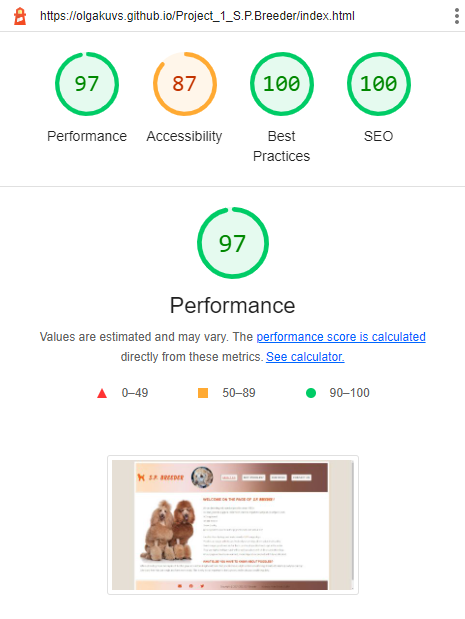
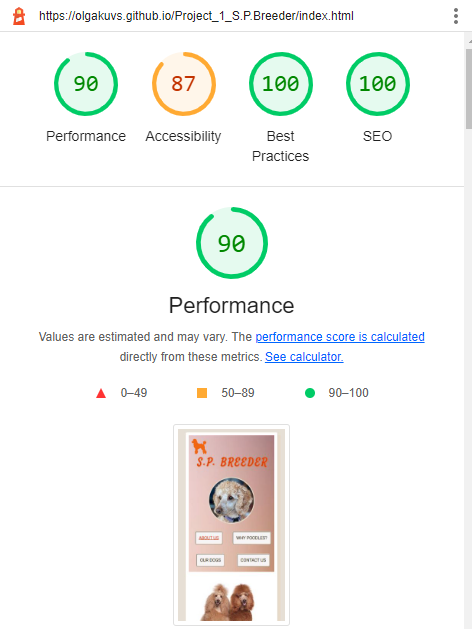

# S.P.Breeder

## Table of content:

- <a href="#introduction">Introduction</a>
- <a href="#project_goals">Project Goals</a>
    - <a href="#user_goals">User Goals</a>
    - <a href="#site_owner_goals">Site Owner Goals</a>
- <a href="#design">Design of the website</a>
    - <a href="#wireframes">Wireframes</a>
    - <a href="#fonts">Fonts</a>
    - <a href="#colours">Colours</a>
    - <a href="#images">Images</a>
    - <a href="#text">Text</a>
- <a href="#features">Features</a>
    - <a href="#existing_features">Existing Features</a>
        - <a href="#header">Header and Navigation Bar</a>
        - <a href="#about_us">About us</a>
        - <a href="#why_poodles">Why poodles</a>
        - <a href="#our_dogs">Our Dogs</a>
        - <a href="#contact_us">Contact Us</a>
        - <a href="#footer">Footer</a>
    - <a href="#future_features">Future Features</a>
- <a href="#technologies">Technologies Used</a>
    - <a href="#languages">Languages</a>
    - <a href="#frameworks">Frameworks, Libraries & Programs Used</a>
- <a href="#testing">Testing</a>
    - <a href="#validation">Validation</a>
    - <a href="#browser">Browser compatability</a>
    - <a href="#responsiveness">Responsiveness</a>
    - <a href="#manual_testing">Manual Testing</a>
    - <a href="#bugs">Known Bugs</a>
- <a href="#deployment">Deployment</a>
- <a href="#credits">Credits</a>
    - <a href="#code">Code</a>
    - <a href="#media">Media</a>
- <a href="#acknowledgements">Acknowledgements</a>

## 
Introduction

This is a website for S.P.Breeder, a Dublin based business which specializes in Standard Poodles breeding. S.P.Breeder represents show quality poodles from European Champion lines which are IKC registered and health tested. The purpose of this website is to establish an online presence for the breeding business. It is a source of information for customers and for potential poodle owners. The site will be useful for people who are looking for a good pedigree poodle puppy.

## 
Project Goals

 

### 
User Goals

- Find information about the breeder.
- Find information about the poodle breed and advantages of this breed.
- Discover pictures and description of our dogs and available puppies.
- Be able to fill out a contact form to reserve a puppy.

### 
Site Owner Goals

- Promote the business.
- Provide clear and easy to read information about the business to customers.
- Encourage customers to know more about the poodles and to buy a puppy if they are interested in this breed.
- Provide information about us as responsible breeders.

## 
Design of the website

### 
Wireframes

- Home Page Wireframe

- [Why poodles Page Wireframe](documentation/balsamiq2.png)

- [Our dogs Page Wireframe](documentation/balsamiq3.png)

- [Contact us Page Wireframe](documentation/balsamiq4.png)

### 
Fonts

The fonts chosen were Roboto for the body, RobotoCondensed for the headings and Satisfy for the logo. Sans Serif was chosen as the backup font. 

### 
Colours

The colour theme is based around the orange colour `#db430c` which harmonizes with the coat colour of poodles. These colours are used for the headings and logo. To create the colour pallete I used [Adobe Color](https://color.adobe.com/create/color-wheel). Brown `#2b1800` was chosen for the font colour as it is less harsh to the users' eyes than black. 

### 
Images

- Image for the header have been used from [Pexels](https://www.pexels.com/photo/brown-curly-haired-small-dog-6544846/) and resized for the purpose of this website.

- Image for Contact us page was downloaded from [FAVPNG](https://favpng.com/download/nDzwGPi2) and resized for the purpose of this website.

- Image for site logo was downloaded from [FAVPNG](https://favpng.com/png_view/puppy-dog-breed-toy-poodle-standard-poodle-dachshund-png/ie8j2Tj1) and adapted to the site design.

- All photos for About us and Our dogs pages are owned by the author. 

### 
Text

- All texts are written by the author.

## 
Features

### 
Existing Features

#### 
Header

- Header includes a simple logo with icon and text, header image and About us, Why poodles, Our dogs and Contact us menu buttons and is responsive on multiple screen sizes.
- The left side of header features the business logo and header image which link to the home page from every page on the site as this is expected by the user.
- Menu buttons with links to each of the four pages of the site: About us, Why poodles, Our dogs and Contact us are positioned on the right as expected by the user.
- The link for the page the user is currently on is underlined.
- When the mouse hovers over a menu button the background colour of the button turns to page body colour to provide easy navigation for the user.

#### 
About us

- This page features a short introduction of S.P.Breeder business and gives it's description and general information.

#### 
Why poodles

- This page provides detailed information about all the benefits of the poodle breed.
- Each section is accompanied by an icon for a better visual representation.

#### 
Our dogs

- These pictures give the user information about the breeding dogs and their litters as well as pictures of puppies currently available for sale.

- When the mouse hovers over a picture a detailed description  of a particular dog with emoji appears. 

#### 
Contact us

- The contact page features a form for the user to enter name, surname and email, all required, and an optional message with a send button. This page allows the user to send any question or ask to reserve a puppy.

#### 
Footer

- The footer is visible on all pages so that social media links, copyright information and address are always available to the user.
- The footer has copyright information, the business address and social media icons with a visual effect of pulsation to attract attention.
- The link from the envelope icon directed to the Contact us form.

### 
Future Features

- 'Our achievements' page could be added to provide more information on the show results and what titles have been achieved and what medals have been received by our dogs and their puppies.
- Some videos of puppies could be added to Our dogs page.
- How to find us panel on the Contact us page with location map can give to user more detailed information about location of business.

## 
Technologies Used

### 
Languages

- HTML5
- CSS3

### 
Frameworks, Libraries & Programs Used

- [Online Diagram Software (Balsamiq):](https://app.diagrams.net/ ) used to create the wireframes.
- [Google Fonts:](https://fonts.google.com/) used to import the Roboto, RobotoCondensed and Satisfy fonts into the style.css file which are used on all pages of the project.
- [Font Awesome:](https://fontawesome.com/icons) used to add icons for aesthetic and UX purposes.
- [Microsoft Paint 3D:](https://apps.microsoft.com/store/detail/paint-3d/9NBLGGH5FV99) was used for resizing images and editing photos for the website.
- [Am I Responsive](https://ui.dev/amiresponsive) used to generate screenshot of different screens.
- [W3Schools](https://www.w3schools.com/) used for general search for HTML and CSS syntax queries.
- [CSS-Tricks](https://css-tricks.com/) used for help with flex box and alignment.
- [Git:](https://git-scm.com/) used for version control by utilizing the Gitpod terminal to commit to Git and Push to GitHub.
- [GitHub](https://github.com/) used to store the project's code after being pushed from Git.
- [Gitpod](https://www.gitpod.io/)
- [Pexels](https://www.pexels.com/)

## 
Testing

### 
Validation

 - Use [W3C Markup Validation Service](https://validator.w3.org/) to validate all HTML pages. All pages pass with no errors no warnings to show.

 

 - Use [W3C CSS Validation Service](https://jigsaw.w3.org/css-validator/) to validate CSS file. All pages pass with no errors.

 

 - Lighthouse in Chrome DevTools used to check performance and found that background and foreground colors do not have a sufficient contrast ratio. No other significant errors were found.

 

 

### 
Browser compatibility

The website was tested on the following browsers:

- Google Chrome
- Mozilla Firefox
- Microsoft Edge

### 
Responsiveness

The website was tested on numerous sized screens including iPhones SE, XR, 12 Pro, Samsungs Galaxy S8, S20, Redmi Note 9, iPads Air, Mini, 15" laptop and was found to respond as expected to all sizes. Chrome DevTools was used throughout the design process to check responsiveness and breakpoints. Adjustments were made accordingly.

### 
Manual Testing

The following links were all manually tested and passed:
- Navigation buttons:

    - The menu buttons links to each of the four pages of the site: About us, Why poodles, Our Dogs and Contact Us.
    - S.B.Breeder logo and the header image links to the home page.
    - The active page link underlines when the page active on the website.
    - The mouse hover action turns font colour and background colour of menu button. 
    - The navigation menu responds to decreasing screen size by moving under the logo and  header image.

- Footer
    - The footer is visible on all pages so that social media links, copyright information and address are always available to the user.
    - The link from the envelope icon directed to the Contact us form.
    - The footer is responsive: the social media icons moves under the address block in the center of the footer as the screen size decreases.
- The form was submitted successfully to Code Institute form dump.

### 
Known Bugs

- It was difficult to get the header icons such as logo image, logo text, header image and navigation bar to display responsively for all sizes of screens. Although Chrome DevTools indicated that the menu was responsive it proved not to display correctly on some screens. Adjustments were made in media queries.
- Placeholder for textarea of contact form was not visible. The solution was found by deleting a space before closing tag.
- My mentor reported an issue with missing homepage links from the logo and header image at the top of pages. Links added.

## 
Deployment

The site was deployed to GitHub pages. The steps to deploy are as follows:

1. Log in to [GitHub](https://github.com/) 
2. Navigate to [OlgaKuvs/Project_1_S.P.Breeder](https://github.com/OlgaKuvs/Project_1_S.P.Breeder) in the list of repositories
3. In the GitHub repository, go to the [Settings](https://github.com/OlgaKuvs/Project_1_S.P.Breeder/settings) tab
4. From the left side menu navigate to Pages, then select the Main Branch
5. Once the main branch has been selected, the page will be automatically refreshed with a detailed ribbon display to indicate the successful deployment

The live link can be found here: [S.B.Breeder](https://olgakuvs.github.io/Project_1_S.P.Breeder/)

## 
Credits

### 
Code

- The icons for Why poodles page were taken from [Font Awesome](https://fontawesome.com/icons)
- Code for Fade in Overlay CSS effect for Our dogs photo gallery was taken from [W3Schools](https://www.w3schools.com/howto/tryit.asp?filename=tryhow_css_image_overlay_fade)
 

### 
Media

Images not referenced below are owned by the author.

- Photos and images
    - Header image by Skyler Ewing from [Pexels](https://www.pexels.com/photo/brown-curly-haired-small-dog-6544846/)

    - Contact us image from [FAVPNG](https://favpng.com/download/nDzwGPi2) 

    - Logo icon from [FAVPNG](https://favpng.com/png_view/puppy-dog-breed-toy-poodle-standard-poodle-dachshund-png/ie8j2Tj1) 

    - Gradient background image for header and footer by Juan Pablo Serrano Arenas from [Pexels](https://www.pexels.com/photo/blurry-image-of-a-brownish-background-1242348/) 

## 
Acknowledgements

I would like to take the opportunity to thank:
- My mentor Rahul Lakhanpal for his feedback, guidance and support.
- Our Cohort Facilitator Alan Bushell for continuous motivation, positive attitude, excellent and useful presentations.
- My husband Sergej for his patience and for freeing me from all household chores to work on my project.