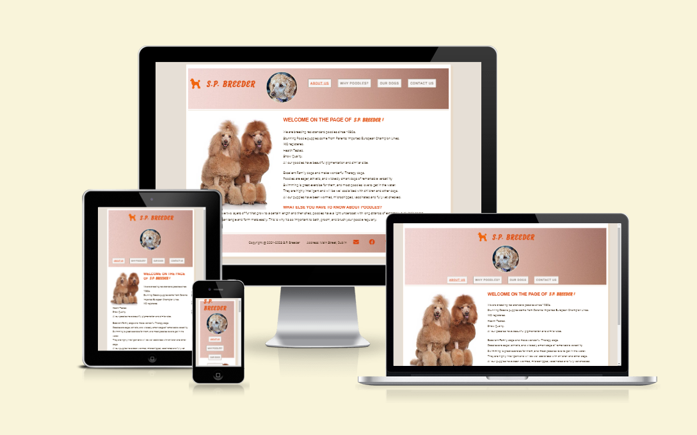
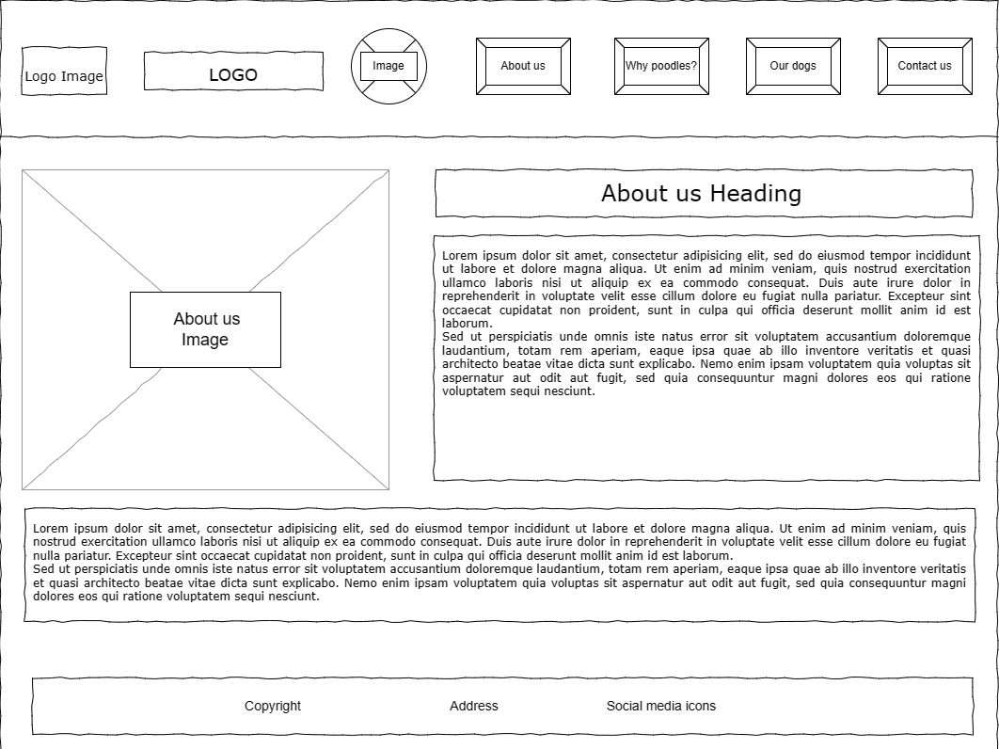
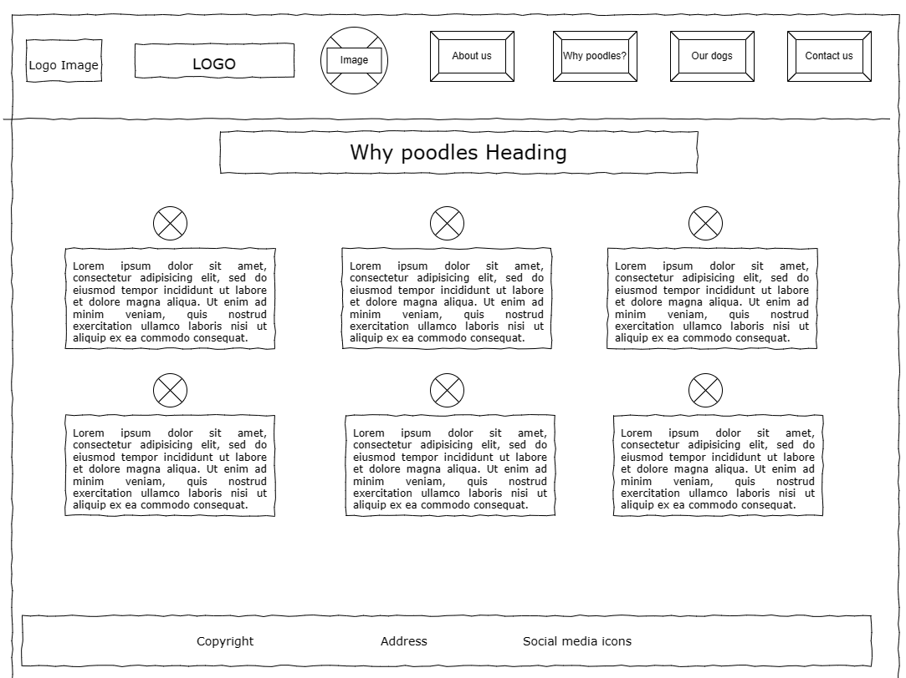
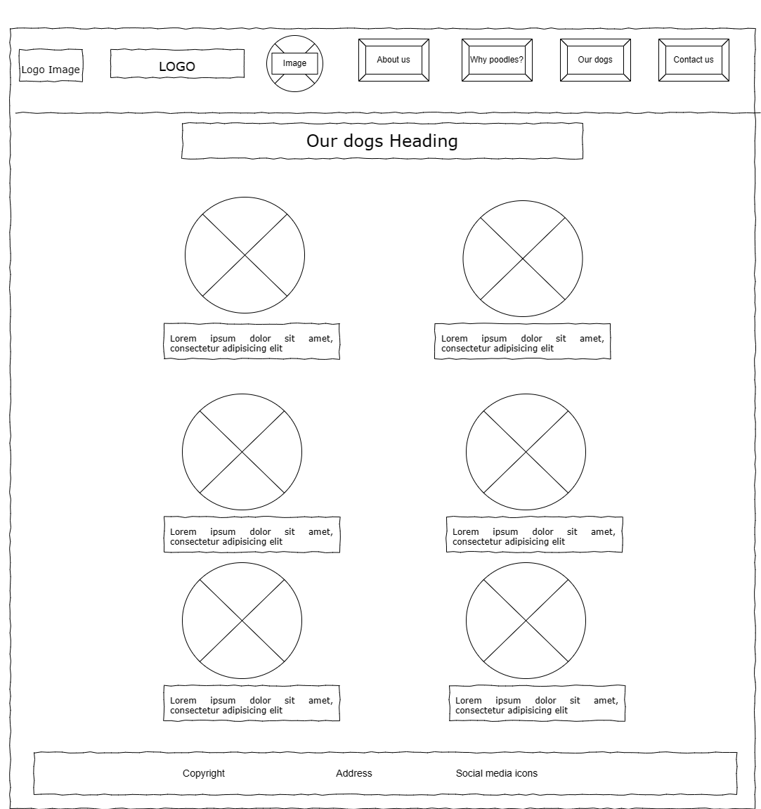
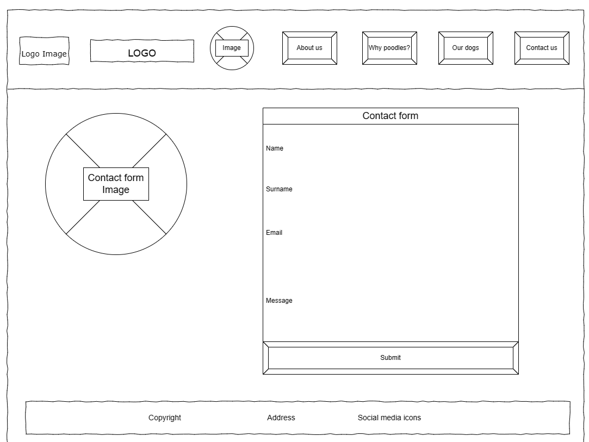
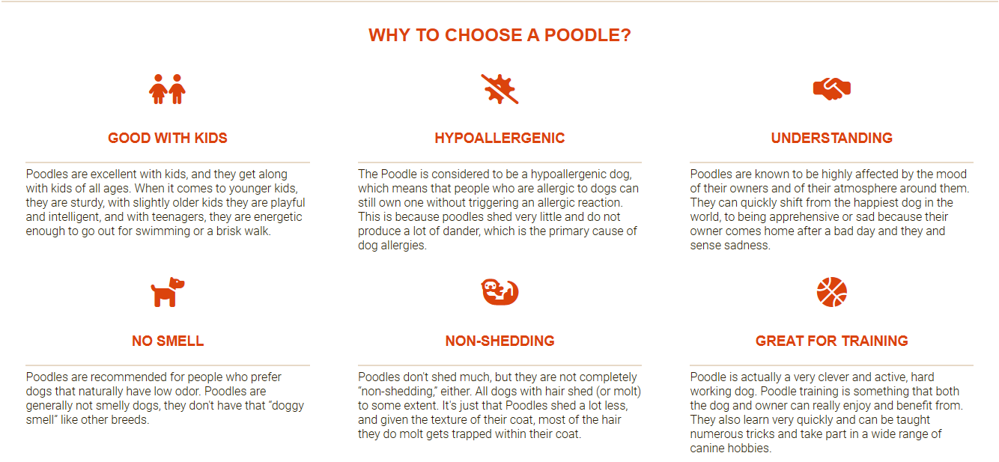
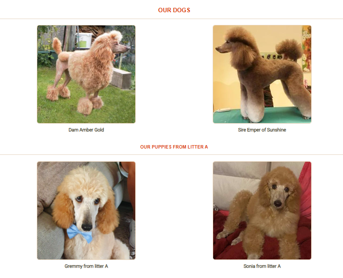
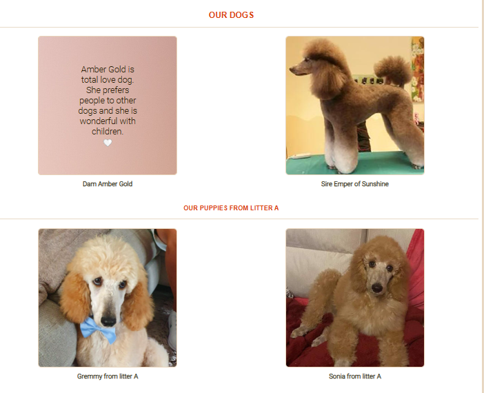
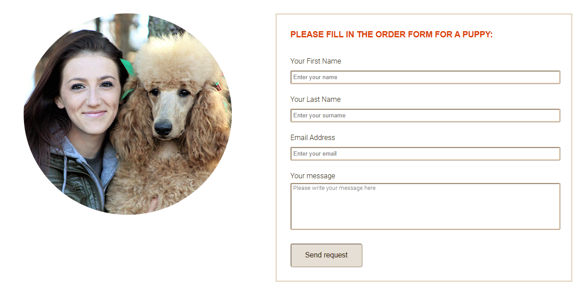
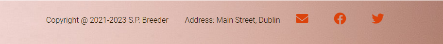

# S.P.Breeder

## Table of content

 

- <a href="#introduction">Introduction</a>
- <a href="#project_goals">Project Goals</a>
    - <a href="#user_goals">User Goals</a>
    - <a href="#site_owner_goals">Site Owner Goals</a>
- <a href="#design">Design of the website</a>
    - <a href="#wireframes">Wireframes</a>
    - <a href="#fonts">Fonts</a>
    - <a href="#colours">Colours</a>
    - <a href="#images">Images</a>
    - <a href="#text">Text</a>
- <a href="#features">Features</a>
    - <a href="#existing_features">Existing Features</a>
        - <a href="#header">Header and Navigation Bar</a>
        - <a href="#about_us">About us</a>
        - <a href="#why_poodles">Why poodles</a>
        - <a href="#our_dogs">Our Dogs</a>
        - <a href="#contact_us">Contact Us</a>
        - <a href="#footer">Footer</a>
    - <a href="#future_features">Future Features</a>
- Technologies Used
    - Languages
    - Frameworks, Libraries & Programs Used
- Testing
    - Validation
    - Responsiveness
    - Manual Testing
    - Known Bugs
    - Unfixed Bugs
- Deployment
- Credits
- Acknowledgements

## 
Introduction

 

This is a website for S.P.Breeder, Dublin based business which specializes in Standard Poodles breeding. S.P.Breeder represents show quality poodles from European Champion lines, IKC registered and health tested. The purpose of this website is to establish an online presence for the breeding business as the source of information for customers and for potencial poodle owners. The site will be useful for people who is looking for good pedigree poodle puppy.

## 
Project Goals

 

### 
User Goals

- Find information about the breeder.
- Find information about the poodle breed and advantages of this breed.
- Discover pictures and description of our dogs and available puppies.
- Be able to fill out a contact form to reserve a puppy.

### 
Site Owner Goals

- Promote the business.
- Provide clear and easy to read information about the business to customers.
- Encourage customers to know more about the poodles and to buy a puppy if they are interested in this breed.
- Provide information about us as responsible breeders

## 
Design of the website

 

### 
Wireframes

- Home Page Wireframe

- Why poodles Page Wireframe

- Our dogs Page Wireframe

- Contact us Page Wireframe

### 
Fonts

The fonts chosen were Roboto for the body, RobotoCondensed for the headings and Satisfy for the logo. Sans Serif was chosen as the backup font. 

### 
Colours

The colour theme is based around the colour of the business logo which is a orange colour `#db430c`. This colour used for the headings and logo because it harmonizes with the coat color of dogs. Brown `#2b1800` was chosen for the font colour as it is less harsh to the users' eyes than black. 

### 
Images

- Image for the header have been used from [Pexels](https://www.pexels.com/photo/brown-curly-haired-small-dog-6544846/) and resized for the purpose of this website.

- Image for Contact us page was downloaded from [FAVPNG](https://favpng.com/download/nDzwGPi2) and resized for the purpose of this website.

- Image for site logo was downloaded from [FAVPNG](https://favpng.com/png_view/puppy-dog-breed-toy-poodle-standard-poodle-dachshund-png/ie8j2Tj1) and adapted to the site design.

- All photos for About us and Our dogs pages are owned by the author. 

### 
Text

- All texts are written by the author.

## 
Features

 

### 
Existing Features

#### 
Header

- Header includes a simple logo with icon and text, header image and About us, Why poodles, Our dogs and Contact us menu buttons and is responsive on multiple screen sizes.
- The left side of header features the business logo and header image which link to the home page from every page on the site as this is expected by the user.
- Menu buttons with links to each of the four pages of the site: About us, Why poodles, Our dogs and Contact us are positioned on the right as expected by the user.
- The link for the page the user is currently on is underlined.
- When the mouse hovers over a menu button the background colour of the button turns to page body colour to provide easy navigation for the user.

#### 
About us

- This page features a short introduction of S.P.Breeder business and gives it's description and general information.

#### 
Why poodles

- This page provides detailed information about all the benefits of the poodle breed.
- Each section is accompanied by an icon for a better visual representation.

#### 
Our dogs

- These pictures give the user information about the breeding dogs and their litters as well as pictures of puppies currently available for sale.

- When the mouse hovers over a picture a detailed description  of a particular dog with emoji appears. 

#### 
Contact us

- The contact page features a form for the user to enter name, surname and email, all required, and an optional message with a send button. This page allows the user to send any question or ask to reserve a puppy.

#### 
Footer

- The footer is visible on all pages so that address and social media links are always available to the user.
- The footer has copyright information, the business address and social media icons with a visual effect of pulsation to attract attention.
- The link from the first envelope icon directed to the Contact us form.

### 
Future Features

- 'Our achievements' page could be added to provide more information on the show results and what titles have been achieved and what medals have been received by our dogs and their puppies.
- Some videos of puppies could be added to Our dogs page.
- How to find us panel on the Contact us page with location map can give to user more detailed information about location of business.

